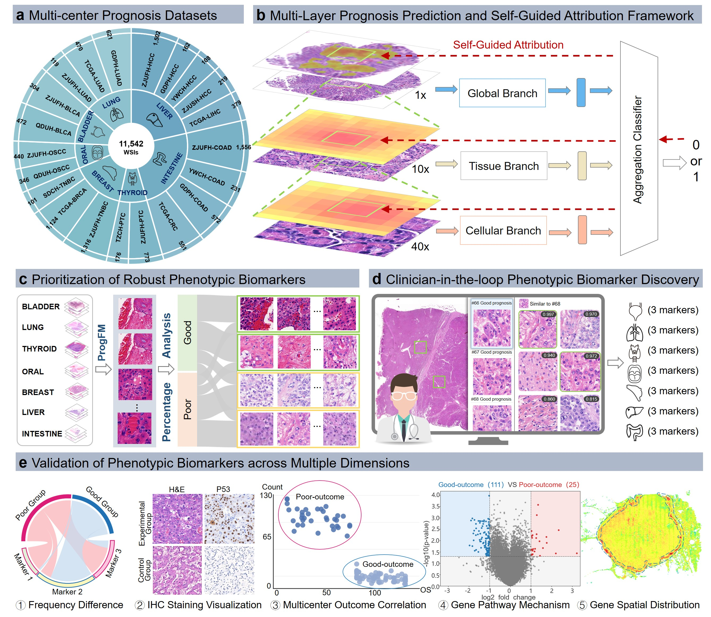

# Autonomous Phenotypic Biomarker Discovery with Self-Guided Prognostic Foundation Model
[](https://creativecommons.org/licenses/by-nc/4.0/)  
> Abstract: Phenotypic biomarkers in histopathology hold strong prognostic value but are difficult to discover systematically due to reliance on subjective annotation, poor scalability, and limited reproducibility. We introduce ProgSeer, an end-to-end platform for autonomous phenotypic biomarker discovery. ProgSeer integrates a self-guided foundation model (ProgFM) that analyzes whole-slide images at both tissue and cellular scales, a frequency-differential filtering strategy to prioritize outcome-associated morphological features, and a clinician-in-the-loop validation interface. Applied to 8 multicenter cohorts across 7 cancer types, ProgFM outperforms current state-of-the-art models in prognostic prediction by about 5\% average margin. Using top three frequency-differential filtering strategy, the framework identifies 21 robust biomarkers, including 4 previously underexplored phenotypic biomarkers. All candidates are validated through multimodal evidence—survival stratification, Immunohistochemical visualization, bulk transcriptomics, and spatial transcriptomic colocalization. ProgSeer provides a scalable, reproducible framework for accelerating biomarker-driven precision oncology.
<p align="center"> 

</p>


## Hardware

- GPU recommended for training and large-scale inference.
- Tested in our environment on **8 NVIDIA RTX 5090 GPUs**.

---

## Quickstart

### 1) Training

Main training entrypoints:

- `train.py`: general training pipeline
- `train_mono.py`, `train_single_label.py`, `train_no_node_label.py`: training variants / ablations
- `train-tissue-esca.py`, `train-tissue-guangzhou.py`, `train-tissue-guangzhou_tiff.py`: cohort-specific tissue training scripts
- `unet-tissue-guangzhou.py`: UNet-based tissue script (baseline/variant)

Example (template):

```bash
python train.py \
  --data_root <PATH_TO_DATASET> \
  --cancer_type <CANCER_NAME> \
  --out_dir <OUTPUT_DIR>
```

### 2) Evaluation / inference

```bash
python test.py \
  --ckpt <PATH_TO_CHECKPOINT> \
  --data_root <PATH_TO_DATASET> \
  --out_dir <OUTPUT_DIR>
```

### 3) WSI thumbnail utilities

```bash
python utils/get_thumb.py --wsi <PATH_TO_WSI> --out <OUT_PNG>
python utils/get_thumb_3.py --wsi <PATH_TO_WSI> --out <OUT_PNG>
```

---

## Project Structure

```text
progseer/
├── dataset/                         # Dataset loaders (private cohorts + variants)
│   ├── sp_camel_dataset.py
│   ├── sp_esca_tissue_dataset.py
│   ├── sp_guangzhou_cell_dataset.py
│   ├── sp_hcc_dataset.py
│   └── sp_hcc_single_dataset.py
├── models/                          # Model definitions (GNN/Transformer/UNet/GTN)
│   ├── graph_transformer.py
│   ├── graph_transformer_pure.py
│   ├── graph_sage.py
│   ├── gcn.py
│   ├── transformer.py
│   ├── medical_transformer.py
│   ├── UNet.py
│   └── GTN.py
├── loss/                            # Loss functions
│   ├── dice_score.py
│   └── fl.py
├── experiments/                     # Transcriptomic analysis scripts (DEG/GSVA and utilities)
│   ├── 0_data.py
│   ├── 1_data_gene.py
│   ├── 2_top20.py
│   ├── 3_gene_data_analysis.py
│   ├── 4_gsva_only.py
│   └── 5_deg_pathway_intersect.py
├── utils/                           # Helper scripts and utilities
│   ├── get_thumb.py
│   ├── get_thumb_3.py
│   ├── utils.py
│   └── utils_single.py
├── train.py                         # Main training entry
├── test.py                          # Evaluation / inference entry
├── main.py                          # Lightweight entry / orchestration (if used)
├── loss_schedule.py                 # Scheduler utilities
├── notebooks/                       # Example notebooks (exploration)
├── log/                             # TensorBoard logs
└── *.ipynb                          # Research notebooks (consider moving under notebooks/)
```

---

## Training & Evaluation

### Training scripts

- `train.py`: main training pipeline
- `train_mono.py`, `train_single_label.py`, `train_no_node_label.py`: variants / ablations
- `train-tissue-esca.py`, `train-tissue-guangzhou.py`, `train-tissue-guangzhou_tiff.py`: cohort-specific setups
- `unet-tissue-guangzhou.py`: UNet-based tissue script

### Models

Graph and transformer modules:

- Graph encoders: `models/gcn.py`, `models/graph_sage.py`, `models/graph_transformer*.py`
- Transformer modules: `models/transformer.py`, `models/medical_transformer.py`
- Auxiliary/baselines: `models/UNet.py`, `models/GTN.py`

### Losses

- Dice and focal-style losses are under `loss/`.
- Scheduling utilities: `loss_schedule.py`.


---

## Transcriptomic Analyses

Scripts under `experiments/` support bulk/spatial transcriptomic corroboration workflows such as:

- preparing gene expression matrices and labels
- differential expression and summary statistics
- GSVA and pathway-level comparisons
- intersections between DEG signals and external gene lists/models

Example (templates):

```bash
python experiments/0_data.py
python experiments/3_gene_data_analysis.py
python experiments/4_gsva_only.py
```

> **TODO**  
> Document required inputs/outputs for each experiment script (file paths, expected columns, gene naming conventions, normalization).

---

## Reproducibility

To facilitate reproducibility, we recommend adding the following artifacts to the repository:

### Pinned environment
- `requirements.txt` with version constraints.

### Dataset schema
- A clear description of expected metadata fields ( `slide_path`, `patient_id`, `center`, `cancer_type`, `event`, `time`, endpoint definition).
- A minimal example CSV (`data/example_metadata.csv`) with dummy values.

